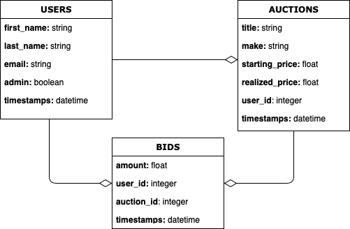

## Software Developer Coding Challenge

Autobid is a auto auction website hosted at https://autobidtoronto.herokuapp.com.

## App Status

## Features

- [ ] Create new auction.
- [ ] Edit new auction.
- [ ] Destroy new auction.
- [ ] Place a bid on auction.
- [ ] Upload image of a car to the auction.
- [ ] Sign up and authenticate users.
- [ ] Record user's bid on a car
- [ ] Get the current winning bid for a car
- [ ] Get a car's bidding history

## Getting Started

Install [bundle](http://bundler.io/)

      git clone https://github.com/medert/software-developer-coding-challenge.git
      cd software-developer-coding-challenge
      bundle install

Install [Postgres app](https://postgresapp.com)

      rails db:setup
      rails s

### Use user names below for test-drive

- Login: Anne.Backer@gmail.com, Pass: password
- Login: John.Doe@gmail.com, Pass: password

## Development

- Ruby (version 2.6.5)
- Rails (5.2.4.2)
- PostgreSQL (vesion 9.6.16)
- Bootstrap
- Front-end Theme - Aranoz(https://colorlib.com/wp/template/aranoz/)
- Devise
- Carrierwave

## Testing

For futher development tasks sucsh running benchmarks and testing, the repo should be cloned and `install bundle`. Required gems are listed in Gemfile.

Install [bundle](http://bundler.io/)

      https://github.com/medert/software-developer-coding-challenge.git
      cd software-developer-coding-challenge
      bundle install

## Test Development

The following gems were used to develop and run unit and feature tests:
- RSpec (http://rspec.info/)
- Capybara (https://github.com/jnicklas/capybara)
- Shoulda-matchers (http://matchers.shoulda.io/)
- FFaker(https://github.com/ffaker/ffaker)
- FactoryBot(https://github.com/thoughtbot/factory_bot)

To prepare for testing, run

    rails db:test:prepare

To run all test specs, run:

    rspec

You may specify an individual test file to run using rspec:

    rspec <full test name>

For example:

    rspec spec/features/01_users_controller_spec.rb

## ER Diagram

  
